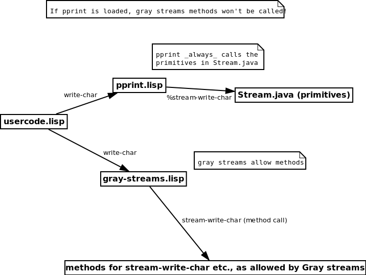
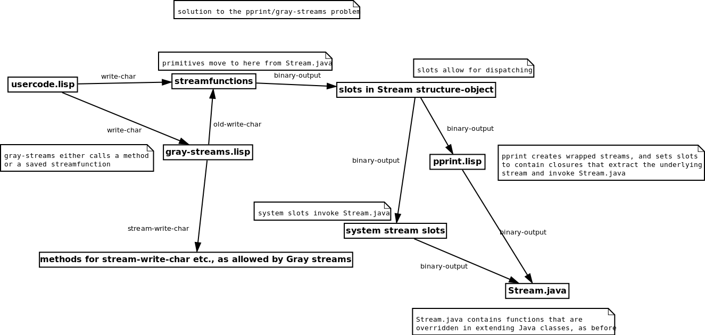

==============================
Design of lisp streams in ABCL
==============================

The previous design
-------------------

Previously, ABCL streams were built-in classes. This presented some problems for Gray streams,
because ABCL CLOS can't use a built-in class as a base class, and Gray streams derive from
a system-stream class. This was corrected by converting ABCL streams to be structure-objects
instead of built-in classes, allowing CLOS to derive from the streams. There was, however, another
problem that revealed a need to change the design in more drastic ways.

The problem with the previous design
~~~~~~~~~~~~~~~~~~~~~~~~~~~~~~~~~~~~

While converting the streams from built-in classes to structure-objects allowed derivation,
the pretty printer still didn't work with Gray streams. Gray streams replace the system stream
functions, saving the old function symbols so that they can be later invoked. The pretty printer,
however, just replaces the stream functions, and calls the low-level primitives directly, thus
bypassing Gray streams completely. The attached image portrays the problem, where pprint will,
for example, invoke %stream-write-char, thus bypassing any methods that there may be for 
stream-write-char using Gray streams.

The planned future design and solution to the problem
-----------------------------------------------------

The solution to the problem is quite similar to how SBCL does its streams. First of all, the pretty printer will
no longer replace stream functions. The stream functionality will be based on closures in the slots of
the structure-object representing the stream, and those closures will invoke low-level i/o functions that
are stream-specific. 

The pretty printer will just setup closures that will extract the underlying stream
object from a pprint-wrapped stream, and invoke its low-level functions. If pprint wrapping isn't present,
the slots will contain closures that directly invoke low-level functions of streams. Gray streams will
still replace the stream functions, because it's capable of invoking the replaced functions.

In addition to these changes, it is planned that the stream function primitives will be moved from the Stream
java class to a streamfunctions library, allowing the stream functions to be written in lisp rather than java.
There's an ongoing aspiration to increase the lisp/java code ratio of ABCL, and this new design allows for that.

